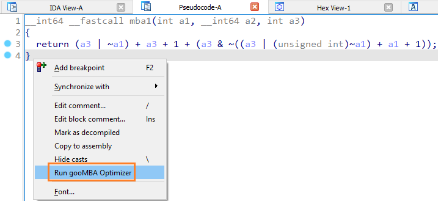

# gooMBA

gooMBA is a Hex-Rays Decompiler plugin that simplifies Mixed Boolean-Arithmetic
(MBA) expressions. It achieves this using several heuristics and algorithms to
achieve orders-of-magnitude better performance than existing state-of-the-art
solutions.

More information on the inner workings of this tool is available in our [blog
post](https://hex-rays.com/blog/deobfuscation-with-goomba/).

## Core Features
- Full integration with the Hex-Rays Decompiler
- Simplifies linear MBAs, including opaque predicates
- Handles sign extension for linear functions
- Verifies soundness of simplifications using the z3 SMT solver
- Simplifies non-linear MBAs with the use of a function fingerprint oracle

## Usage

By default, the plugin does not run automatically. You can invoke the plugin
by right clicking in the pseudocode view and selecting "Run gooMBA Optimizer".
In addition, you can set up a keyboard shortcut in IDA by opening Options ->
Shortcuts... and adding a shortcut for the `goomba:run` action.

Several options for usage are available within `goomba.cfg`. You can set up a
fingerprint oracle, configure the z3 proof timeout time, choose the desired behavior when
timeouts occur, and choose to make the plugin run automatically without needing
to be invoked from the right-click menu.

## Demo

The sample database `tests/idb/mba_challenge.i64` was created from the [`mba_challenge`](https://github.com/mrphrazer/msynth/blob/main/samples/mba_challenge) binary.
The functions `mba1`, `mba2`, `mba3`, `mba`, `solve_me` contain MBA expressions of varying complexity.

For example, the `mba1` function's initial pseudocode:

And after running gooMBA optimization:

## Fingerprint oracle

The oracle can be used for simplifying non-linear MBAs.
The input for generaring it is a list of candidate expressions in [msynth](https://github.com/mrphrazer/msynth) syntax.
You can use `generate_oracle.sh` or `generate_oracle.bat` to generate a binary 
oracle file which can then be used by the plugin by specifying the path to it 
in `goomba.cfg` (parameter `MBA_ORACLE_PATH`).

A large pre-computed oracle is available [here](https://hex-rays.com/products/ida/support/freefiles/goomba-oracle.7z)

NOTE: oracle files generated with IDA 8.2 can only be used with 64-bit binaries, otherwise you may hit internal error 30661.
